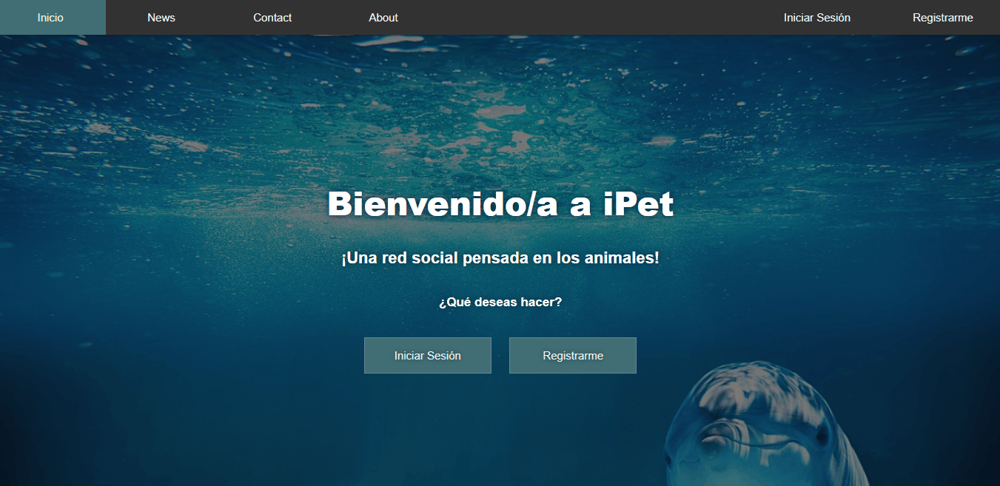
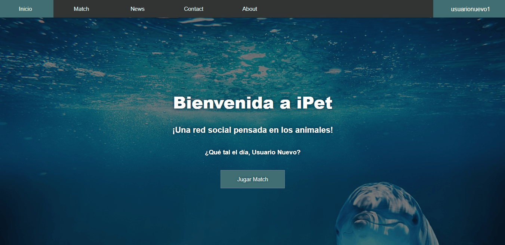
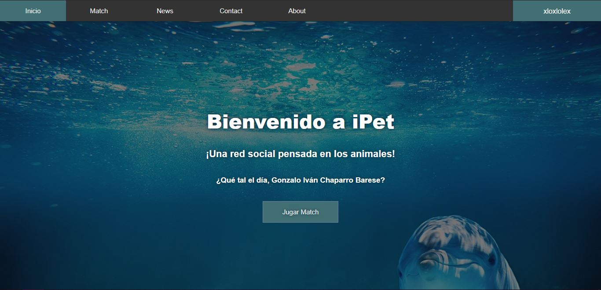
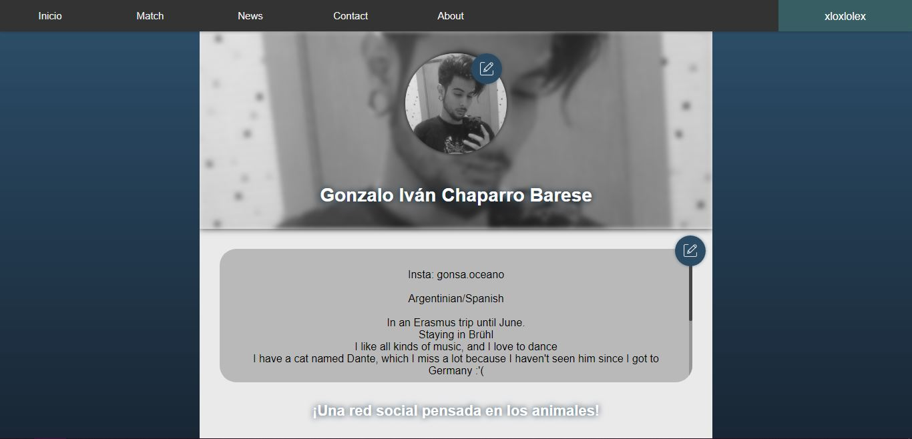
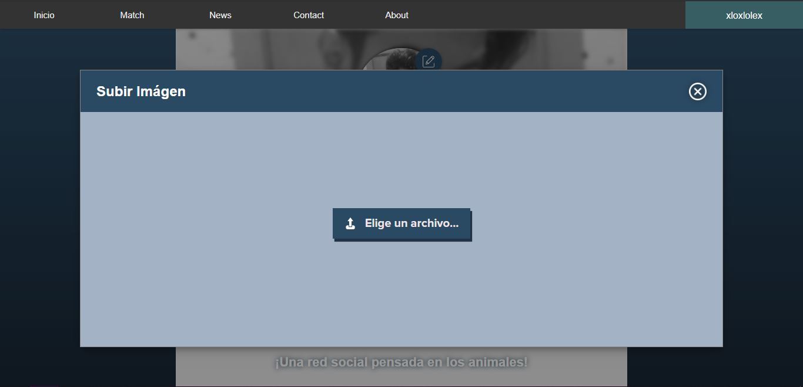
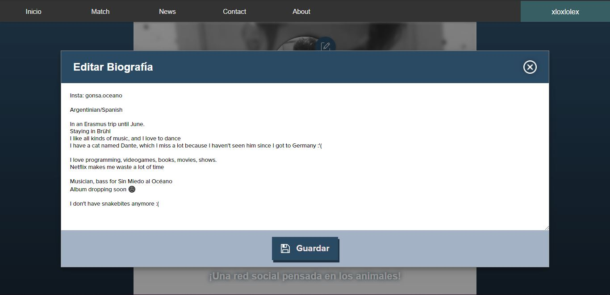
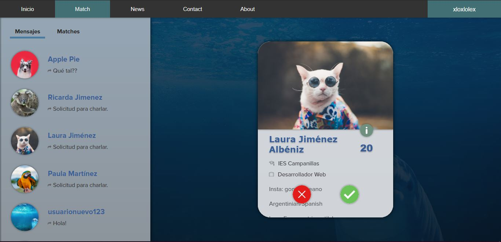
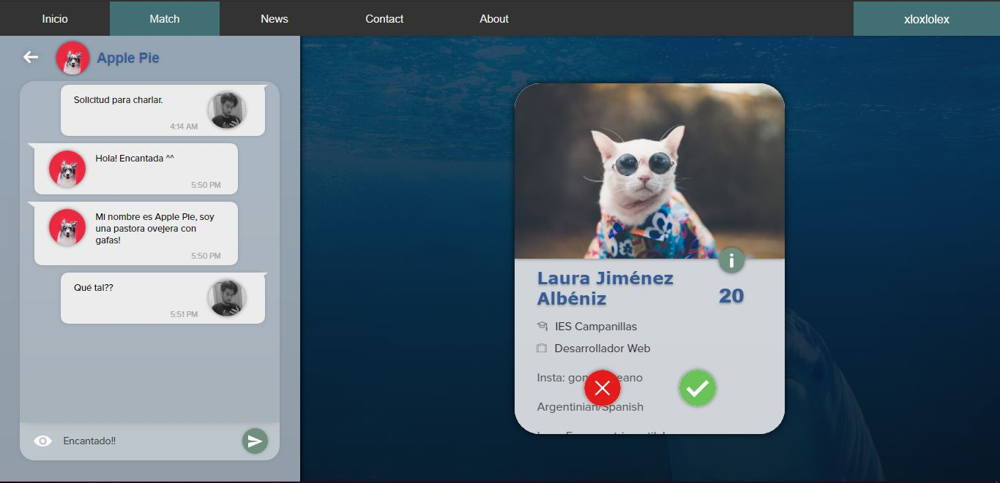
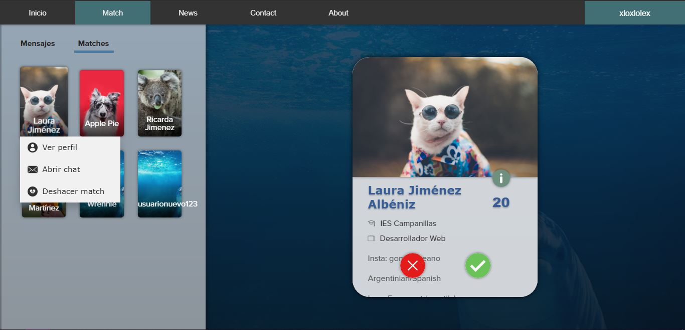

# iPet

iPet es una aplicación web desarrollada en PHP que implementa las últimas tecnologías disponibles.
iPet está enfocada a los animales, y a sus respectivos dueños.

## Utilización

Primero, debemos registrarnos en la aplicación:

Una vez hayamos registrado una nueva cuenta, podemos proceder a actualizar nuestra imágen de perfil:

Una vez hayamos actualizado nuestra imágen de perfil, podemos proceder a jugar al Match:

Si los usuarios a los que le hemos dado Like tambien nos dan like. Aparecerán en la pestaña "Matches" y podremos ver su perfil, abrir un nuevo chat con el usuario deseado o deshacer el match:

## Propósito

El propósito de esta aplicación es unir a dueños de mascotas de toda España para que socializen entre sí y sus mascotas sean más felices!

## Capturas de Pantalla

### Inicio

### Perfil

### Perfil: Actualizar Imágen

### Perfil: Actualizar Biografía

### Match: Mensajes

### Match: Chat

### Match: Matches

## Contribuciones
Pull Requests abiertos.

Siéntete libre de actualizar cualquier punto de la aplicación que veas necesario. Yo lo revisaré y lo aceptaré o no.
Muchas gracias.

## Tecnologías Utilizadas

PHP7 (Modelo MVC), HTML5, CSS3, Heroku, MySQL, JQuery (JavaScript), AJAX, Firebase Storage...

Sorprendentemente, 0% de Boostrap ha sido utilizado.

## Demostración de funcionamiento
[Demo](http://ipet-php.herokuapp.com)

## Licencia
[MIT](https://choosealicense.com/licenses/mit/)
